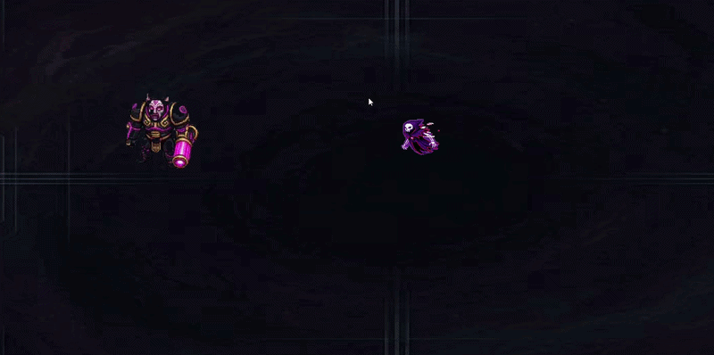

# 🎮 Vaudou Glitch

<p align="center">
  
  
  
  
</p>

> **Vaudou Glitch** est un jeu de survie et d'action 2D rétro inspiré des roguelites modernes (*Vampire Survivors-like*). Survivez à des vagues incessantes d'ennemis, améliorez votre arsenal magique et hissez votre nom au sommet du tableau des scores d'arcade !

---

<p align="center">
  
</p>

<p align="center">
  <a href="#-état-du-projet--version-jouable"><strong>🎮 Version Jouable</strong></a> •
  <a href="#-fonctionnalités-clés"><strong>✨ Fonctionnalités</strong></a> •
  <a href="#-architecture--stack-technique"><strong>🛠️ Stack Technique</strong></a> •
  <a href="#-contrôles"><strong>🕹️ Contrôles</strong></a>
</p>

---

## 🚀 État du projet & Version jouable

> ⏳ **Version binaire téléchargeable :** En cours de finalisation. L'exécutable Windows sera prochainement disponible au téléchargement direct.
> 
> 💡 *Pour tester le jeu immédiatement, vous pouvez le lancer directement dans l'éditeur Unity (voir la section [Installation & Compilation](#-installation--compilation-pour-les-développeurs)).*

---

## ✨ Fonctionnalités clés

### ⚔️ Système de Combat & Arsenal Évolutif
- **Système d'armes modulaires (`WeaponManager`)** : Gestion fluide de plusieurs armes simultanées avec délais de rechargement, portées et vitesses configurables.
- **Projectiles variés** :
  - 🔥 *Fireball* : Projectiles explosifs à dégâts de zone.
  - ⚡ *Laser* : Faisceau instantané perforant les lignes ennemies.
  - ✨ *Magic Bolt* : Salves d'énergie téléguidées ou rapides.

### 👾 Ennemis & Vagues Dynamiques
- **Générateur de vagues adaptatif (`EnemySpawner`)** : Régulation de la fréquence d'apparition selon le temps de jeu et la survie du joueur.
- **Archétypes d'ennemis variés** :
  - 🏃 **Chaser** : Ennemis véloces traquant le joueur sans relâche.
  - 🛡️ **Tank** : Monstres massifs absorbant de lourds dégâts.
  - 👑 **Boss** : Menaces majeures dotées de patterns d'attaque spécifiques et de tirs de projectiles (`EnemyFireball`).

### 💎 Progression Roguelite & Collectibles
- **Système d'expérience et niveaux** : Récupération d'orbes d'XP (`XPOrb`) laissées par les ennemis pour monter en niveau.
- **Zone magnétique (`MagnetZone`)** : Attire automatiquement les orbes et bonus proches vers le joueur.
- **Bonus tactiques** :
  - 🛡️ *Shield* : Bouclier protecteur temporaire.
  - 🎯 *PowerRange* : Extension instantanée de la portée et puissance d'attaque.

### 🕹️ Interface & High Scores Arcade
- **Tableau des meilleurs scores (`HighScoreTable`)** : Enregistrement persistant des scores.
- **Saisie rétro style borne d'arcade (`ReadLetterInput`)** : Saisie de 3 initiales pour immortaliser votre score.
- **Menus interactifs** : Écran d'accueil (`Start`), HUD en jeu dynamique (`Game`), et écran de fin avec bilan (`End`).

---

## 🛠️ Architecture & Stack Technique

Le projet met l'accent sur une structure de code C# propre, modulaire et découplée sous Unity.

| Composant | Détails techniques |
| :--- | :--- |
| **Moteur** | Unity 6 (`6000.3.11f1`) |
| **Pipeline de rendu** | Universal Render Pipeline (URP 2D) avec Post-Processing et éclairage dynamique |
| **Langage** | C# (.NET Standard) |
| **Input System** | Nouveau *Unity Input System* (`InputSystem_Actions`) pour un support fluide clavier / manette |
| **Animation 2D** | Animator Controllers avec State Machines, blend trees et paramètres dynamiques |
| **VFX & Audio** | Système de particules Unity (`ParticleSystem` pour impacts et éliminations), `MusicManager` |

### Structure des Scripts C#

```text
Assets/_MyAssets/Scripts/
├── Enemy/                 # Classes dérivées d'ennemis (Boss, Chaser, Tank)
├── Managers/              # Singletons & coordinateurs (GameManager, Spawner, Music)
├── PickUps/               # Bonus et objets à collecter (XP, Bouclier, Portée)
├── Player/                # Contrôleur joueur, détection des collisions & magnétisme
├── Projectiles/           # Comportements des projectiles alliés et ennemis
├── UI/                    # Gestion des interfaces et système de High Score Arcade
└── Weapons/               # Classe de base Weapons et implémentations des armes
```

---

## 🕹️ Contrôles

| Action | Clavier (ZQSD / Flèches) | Manette (Optionnel) |
| :--- | :--- | :--- |
| **Déplacement** | <kbd>Z</kbd> <kbd>Q</kbd> <kbd>S</kbd> <kbd>D</kbd> ou <kbd>↑</kbd> <kbd>←</kbd> <kbd>↓</kbd> <kbd>→</kbd> | Stick analogique gauche |
| **Attaque** | Automatique ou <kbd>Espace</kbd> / Clic souris | Bouton d'action / Gâchette |
| **Navigation Menus** | Souris ou Flèches directionnelles | Croix directionnelle |
| **Validation Score** | <kbd>Entrée</kbd> | Bouton <kbd>A</kbd> |

---

## 💻 Installation & Compilation (Pour les développeurs)

Si vous souhaitez ouvrir le projet dans l'éditeur Unity :

1. Clonez ce dépôt :
   ```bash
   git clone https://github.com/liliakeren08/Jeu-Plateforme-Unity.git
   ```
2. Ouvrez **Unity Hub**.
3. Cliquez sur **Add** et sélectionnez le dossier du projet.
4. Assurez-vous d'utiliser **Unity 6 (6000.3.11f1)** ou une version ultérieure compatible.
5. Ouvrez la scène de démarrage : `Assets/_MyAssets/Scenes/Start.unity`.
6. Appuyez sur **Play** ▶️ dans l'éditeur !

---

## 👥 Équipe de Développement

Projet développé avec passion par le studio **JalAmeBomDia** :
- **Esdras Amedjiko**
- **Wyll Jalbert**
- **Lilia Keren Bombo**
- **Diakite**

---

<p align="center">
  <i>N'hésitez pas à laisser une ⭐️ si vous avez apprécié le jeu !</i>
</p>
